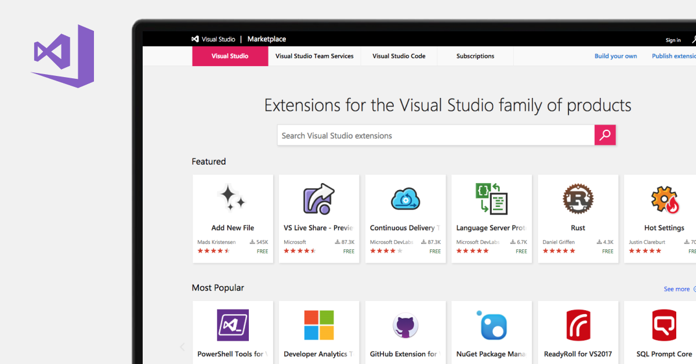

## 什么是Visual Studio扩展

> https://visualstudio.microsoft.com/zh-hans/vs/features/extend/

**Visual Studio扩展**(`Visual Studio Extend`)是可以允许你在Visual Studio中进行自定义并增强在其中的体验的附加项，通过添加新功能或集成现有工具实现。扩展复杂程度不一，但是其主要用途在于提高工作效率并满足工作流需求。

## 相关文章

* [乘风破浪，遇见最美Windows 11之现代Windows桌面应用开发 - Visual Studio扩展开发](https://www.cnblogs.com/taylorshi/p/15425428.html)